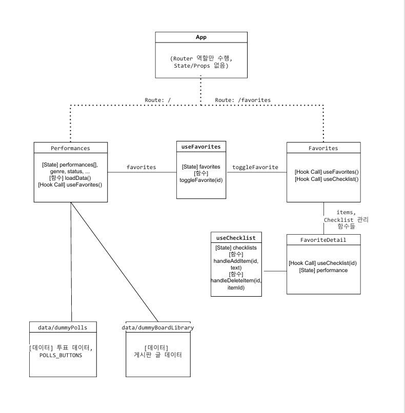
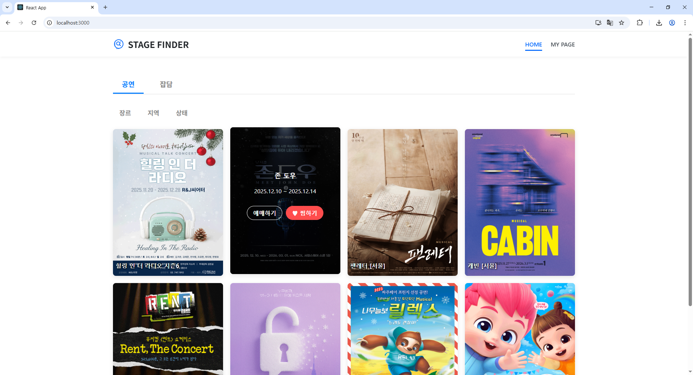
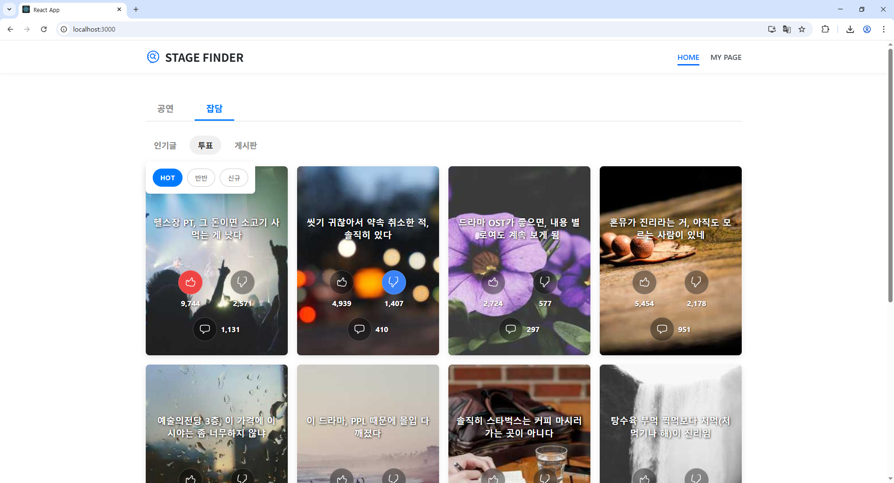
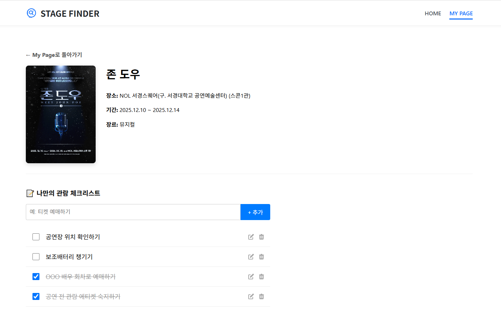
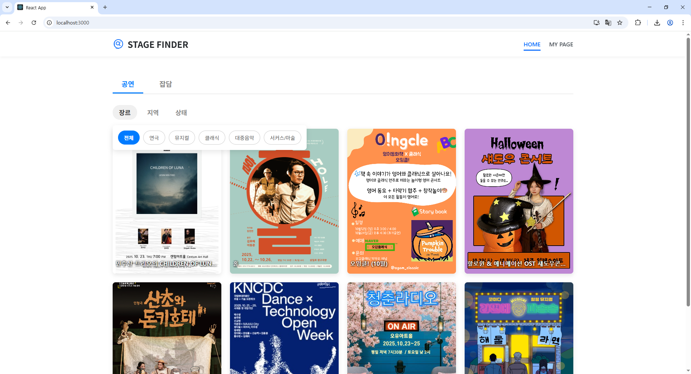
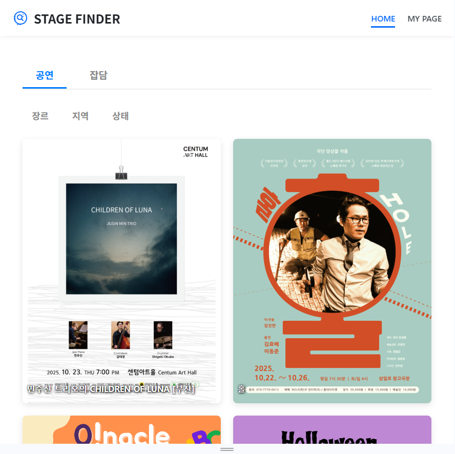
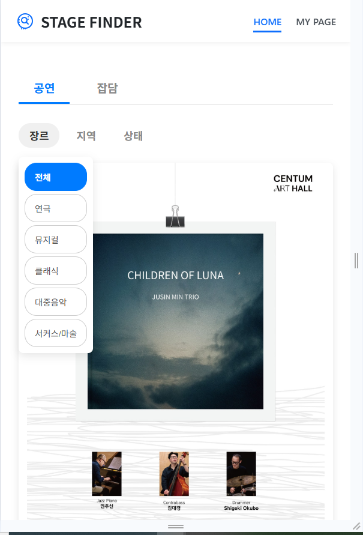

# 🎭 STAGE FINDER - 공연 정보 탐색 및 커뮤니티 플랫폼

STAGE FINDER는 KOPIS API를 활용하여 국내 공연 정보를 손쉽게 탐색하고, 사용자들과 소통할 수 있는 커뮤니티 기능을 제공하는 React 기반의 SPA(Single Page Application) 프로젝트입니다.

 

## 1. 기획 의도

공연 정보는 여러 예매 사이트에 흩어져 있어 한눈에 보기 어렵고, 공연에 대한 감상이나 팁을 나누는 커뮤니티는 활성화된 곳을 찾기 어렵다는 문제점에서 출발했습니다. STAGE FINDER는 **흩어진 공연 정보를 한 곳에 모아 필터링 및 무한 스크롤로 편하게 탐색**하고, **공연 팬들을 위한 커뮤니티 공간을 제공**하여 정보 탐색과 소통의 경험을 모두 만족시키는 것을 목표로 합니다.

- **참고 사이트 및 차별점**

- **참고 사이트:** 인터파크 티켓, 예스24 티켓 등 기존 예매 사이트

- **차별점:**

1.  **커뮤니티 기능 통합:** 단순 정보 조회를 넘어, [인기글], [투표], [게시판] 기능을 통해 사용자 간의 활발한 소통을 유도합니다.

2.  **개인화된 '준비 체크리스트':** 공연 관람 전 필요한 준비물(보조배터리, 티켓, 신분증 등)을 챙기기 위해 SNS에서 체크리스트를 공유하는 경우가 많습니다. STAGE FINDER는 이 경험을 서비스 내에 통합했습니다. 사용자는 **찜한 공연별로 나만의 '준비 체크리스트'를 직접 생성하고 관리**함으로써, 분산된 정보 없이 체계적으로 관람을 준비할 수 있습니다.

3.  **분산된 예매처 정보의 통합 게이트웨이:** 기존 예매 사이트(인터파크, 예스24 등)는 자사에서 판매하는 공연 정보만 보여줍니다. 하지만 STAGE FINDER는 KOPIS API를 통해 이들을 포함하여, **네이버 예매, 개별 극단 자체 사이트** 등 흩어져 있는 **모든 예매처의 정보를 집계**합니다. 사용자는 '예매하기' 버튼을 통해 KOPIS 공식 상세 페이지로 이동하며, 그곳에 있는 **'예매처 바로가기'**를 통해 다시 검색할 필요 없이 원하는 예매처로 정확하게 이동할 수 있습니다.

- **팀 협업 노션 링크**

- [여기에 팀 노션 페이지 링크를 삽입하세요]

 

## 2. 핵심 기능 구현

| 기능                 | 구현 내용                                                                                                                   | 적용 기술/코드                    |
| :------------------- | :-------------------------------------------------------------------------------------------------------------------------- | :-------------------------------- |
| **CRUD**             | **'나만의 체크리스트' 기능**을 중심으로 CRUD를 구현했습니다.                                                                | `useChecklist.js`                 |
|                      | **C (Create):** `addItem()`을 통해 새 체크리스트 항목 추가                                                                  | `FavoriteDetail.js`               |
|                      | **R (Read):** `items` 상태를 통해 해당 공연의 체크리스트 목록 조회                                                          | `FavoriteDetail.js`               |
|                      | **U (Update):** `updateItem()`, `toggleItem()`으로 항목 내용 수정 및 완료 처리                                              | `FavoriteDetail.js`               |
|                      | **D (Delete):** `deleteItem()`으로 특정 항목 삭제                                                                           | `FavoriteDetail.js`               |
| **SPA (Routing)**    | `react-router-dom`을 사용하여 페이지 간 깜빡임 없는 사용자 경험 제공                                                        | `App.js` 내 `<Routes>`, `<Route>` |
| **무한 스크롤**      | **`Intersection Observer API`**를 직접 구현하여 사용자가 페이지 하단에 도달하면 다음 페이지의 데이터를 자동으로 로드합니다. | `Performances.js`                 |
| **코드 스플리팅**    | 초기 로딩 속도 최적화를 위해 각 페이지 컴포넌트를 **`lazy()`**와 **`<Suspense>`**를 사용하여 분리했습니다.                  | `App.js`                          |
| **외부 데이터 연동** | **KOPIS (공연예술통합전산망)**의 오픈 API를 활용하여 실시간 공연 데이터를 연동했습니다.                                     | `api/kopis.js`                    |
| **반응형 웹**        | CSS Grid Layout과 Media Query를 활용하여 PC, 태블릿, 모바일 등 다양한 디바이스 환경에 대응하는 UI를 구현했습니다.           | `Performances.css` 등             |

 

## 3. 팀원 및 역할 분담

### 박태오 (팀장 / Front-End)

- **프로젝트 총괄 및 아키텍처 설계:** 초기 기술 스택 선정, Custom Hook 기반의 상태 관리 구조 설계 및 팀원 간의 역할 조율을 담당했습니다.

- **공연 목록 다중 필터링:** `Performances.js` 내에서 다중 조건(장르, 지역, 공연 상태)에 따라 실시간으로 API를 재호출하고 목록을 갱신하는 핵심 로직을 구현했습니다.

- **커뮤니티 '인기글' 기능:** `일간/주간/월간` 탭 UI를 개발하고, 각 탭에 `IntersectionObserver`를 적용하여 콘텐츠를 무한 스크롤로 불러오는 기능을 구현했습니다.

- **반응형 웹 디자인:** 미디어 쿼리를 활용하여 PC, 태블릿, 모바일 등 다양한 디바이스 환경에 대응하는 UI를 구현했습니다.

### 전유진 (팀원 / Front-End)

- **MY PAGE 총괄 및 CRUD 구현:** 찜 목록 조회(`Favorites.js`)부터 상세 페이지(`FavoriteDetail.js`)까지 이어지는 'MY PAGE'의 전체 사용자 흐름을 담당했습니다.

- **개인화 체크리스트 (CRUD):** `useChecklist.js` 커스텀 훅을 직접 설계하여 체크리스트의 생성(Create), 조회(Read), 수정(Update), 삭제(Delete) 로직을 모두 완성했습니다.

- **SPA 라우팅 및 전역 상태 관리:** `React Router`를 사용한 전체 페이지 라우팅 구조를 설계하고, `localStorage`와 `useFavorites` 커스텀 훅을 통해 앱 전역의 '찜하기' 상태를 관리하는 로직을 개발했습니다.

- **커뮤니티 '게시판' 기능:** `selectedCommunityTab` 상태에 따라 조건부로 렌더링되는 `BoardLibraryPage` 컴포넌트의 기본 구조와 UI를 담당했습니다.

- **전체 CSS 스타일링:** 프로젝트의 일관된 디자인 시스템을 적용하고 전체적인 CSS 스타일링을 담당했습니다.

### 오인준 (팀원 / Front-End)

- **커뮤니티 '투표' 기능 개발:** `Performances.js` 내 커뮤니티 탭 기능 중 '투표' 파트를 전담했습니다.

- **'투표' 필터링 로직 구현:** `dummyPolls.js` 데이터와 연동하여 동적 필터링 탭 UI를 구현하고, 선택된 필터(`selectedPollsType`)를 `PollsPage` 컴포넌트에 `prop`으로 전달하여 조건부 렌더링하는 로직을 개발했습니다.

## 4. Flow 및 UI

### 기능 흐름도 (Flow Chart)

## 5. 주요 기능 실행 화면

### (1) 🎭 공연 카테고리

**1. 핵심 기능 (GIF)**
_(필터링 및 무한 스크롤)_

 

<b>🔍 기능 상세 보기 (구현 목록 및 스크린샷)</b>

 
<b>[주요 구현 기능]</b>
<ul>
  <li>KOPIS (공연예술통합전산망) <b>외부 API 연동</b></li>
  <li>'장르', '지역', '상태' 3가지 State를 조합한 <b>동적 API 재호출</b> (중첩 필터링)</li>
  <li><code>Intersection Observer</code> API를 사용한 <b>무한 스크롤</b> 구현</li>
  <li><code>useFavorites</code> 커스텀 훅을 통한 전역 <b>'찜하기'</b> 상태 관리</li>
  <li>KOPIS 상세 페이지로 연결되는 <b>'예매하기'</b> 링크 제공</li>
</ul>

<b>[대표 스크린샷]</b> 
아래는 3가지 필터가 중첩 적용된 결과이며, 카드에 마우스를 올렸을 때 '찜하기'와 '예매하기' 버튼이 활성화된 화면입니다.
 

---

### (2) 💬 잡담 카테고리

**1. 커뮤니티 탭 기능 (GIF)**
_(메인 탭 네비게이션)_

 

<b>🔍 기능 상세 보기 (구현 목록 및 스크린샷)</b>

 
<b>[주요 구현 기능]</b>
<ul>
  <li>'인기글', '투표', '게시판' 3가지 메인 탭으로 <b>조건부 렌더링</b></li>
  <li>'인기글' 탭: '일간/주간/월간' 하위 필터링 및 <b>무한 스크롤</b> 적용</li>
  <li>'투표' 탭: 'HOT/반반/신규' 하위 필터링 및 <b>'좋아요/싫어요' 투표 로직</b> 구현</li>
  <li>'게시판' 탭: 게시판 라이브러리 페이지로 <b>라우팅</b> 및 개별 게시판 <b>'찜하기'</b> 기능 구현</li>
</ul>

<b>[대표 스크린샷]</b> 
아래는 커뮤니티 탭의 대표 기능 중 하나인 '투표' 탭의 구현 화면입니다.
 

---

### (3) ⭐️ MY PAGE

**1. 찜 취소 및 체크리스트 CRUD (GIF)**
_(체크리스트 CRUD 전체 사이클)_

 

<b>🔍 기능 상세 보기 (구현 목록 및 스크린샷)</b>

 
<b>[주요 구현 기능]</b>
<ul>
  <li>'찜 목록' 페이지: 찜한 항목 <b>조회(Read)</b> 및 <b>삭제(Delete)</b> 기능 구현</li>
  <li>'체크리스트' 상세 페이지: <code>useChecklist</code> 커스텀 훅을 통한 <b>CRUD</b> 구현</li>
  <li><code>localStorage</code>를 활용한 체크리스트 데이터 영구 저장</li>
  <li>항목 <b>생성(Create)</b>, <b>조회(Read)</b>, 체크박스를 통한 <b>수정(Update)</b>, 버튼을 통한 <b>삭제(Delete)</b></li>
</ul>

<b>[대표 스크린샷: 체크리스트 CRUD]</b> 
이 상세 페이지에서 **CRUD** 4가지 기능이 모두 구현됩니다. 
`localStorage`에서 목록을 **조회(Read)**하고, 하단의 입력폼으로 항목을 **생성(Create)**하며, 체크박스로 상태를 **수정(Update)**하고, 아이콘으로 **삭제(Delete)**할 수 있습니다.
 

---

### (4) 🖥️ 반응형 웹 디자인 (전체 페이지 적용)

프로젝트의 **모든 페이지**는 CSS Grid Layout과 Media Query를 활용하여 PC, 태블릿, 모바일 등 다양한 디바이스 환경에 대응합니다. (아래는 '잡담' 탭의 예시 화면입니다.)

<table border="0" style="border:none; border-collapse:collapse;">
  <tr style="border:none;">
    <td align="center" style="border:none; padding: 5px;">
      
       <b>PC (데스크탑)</b>
    </td>
    <td align="center" style="border:none; padding: 5px;">
      
       <b>태블릿 (886px)</b>
    </td>
    <td align="center" style="border:none; padding: 5px;">
      
       <b>모바일 (582px)</b>
    </td>
  </tr>
</table>
